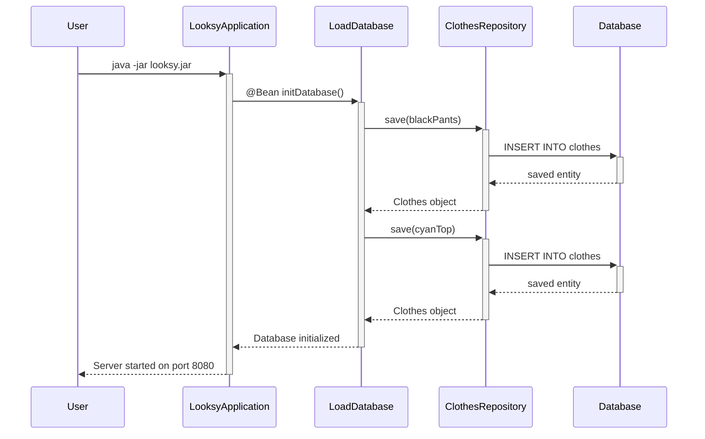

# Application Startup Flow

This diagram shows how the Looksy application starts up and initializes the database with sample data.

## Key Components:
- **LooksyApplication**: Main Spring Boot application entry point
- **LoadDatabase**: Configuration class that preloads sample data
- **ClothesRepository**: JPA repository for database operations
- **Database**: The underlying database (H2/MySQL/PostgreSQL)

## Process:
1. User starts the application
2. Spring Boot initializes and discovers @Bean methods
3. LoadDatabase creates sample Clothes objects
4. Repository saves them to the database
5. Application startup completes