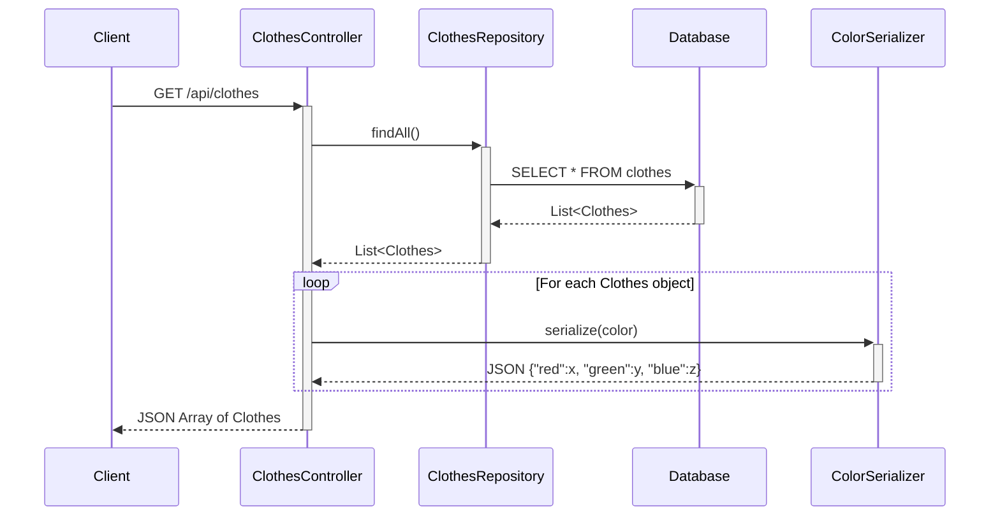

# Get All Clothes Flow

This diagram shows how the system retrieves all clothes from the database and serializes them to JSON for the client.

## API Endpoint:
- **Method**: GET
- **URL**: `/api/clothes`
- **Response**: JSON array of all clothes in the wardrobe

## Key Components:
- **ClothesController**: REST controller handling HTTP requests
- **ClothesRepository**: JPA repository for database access
- **ColorSerializer**: Custom Jackson serializer for Color objects

## Process:
1. Client sends GET request to retrieve all clothes
2. Controller calls repository to fetch data from database
3. Database returns all clothes records
4. For each clothes item, the Color field is serialized to JSON format
5. Complete JSON array is returned to client