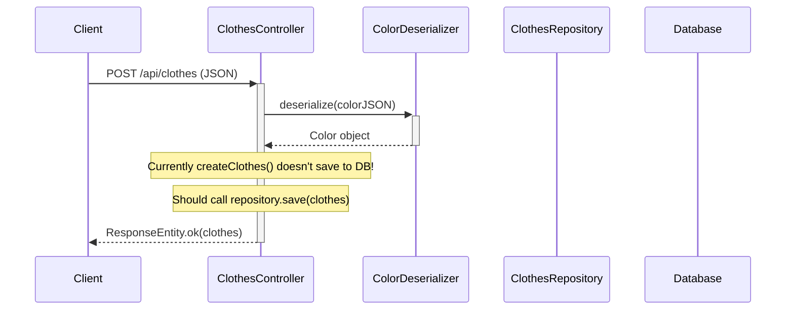

# Create New Clothes Flow

This diagram shows how new clothes are created via POST request. **Note: There's currently a bug in this implementation.**



## API Endpoint:
- **Method**: POST
- **URL**: `/api/clothes`
- **Request Body**: JSON representation of Clothes object
- **Response**: The same Clothes object (but not persisted!)

## ⚠️ Current Bug:
The `createClothes()` method in `ClothesController` **does not save the clothes to the database**. It only returns `ResponseEntity.ok(clothes)` without calling `repository.save(clothes)`.

## Expected Process Should Be:
1. Client sends POST request with clothes JSON
2. ColorDeserializer converts color JSON to Color object
3. **Controller should call `repository.save(clothes)`**
4. **Repository should save to database**
5. Return the saved clothes with generated ID

## Fix Required:
```java
@PostMapping
public ResponseEntity<Clothes> createClothes(@RequestBody Clothes clothes) {
    Clothes saved = repository.save(clothes);  // Add this line!
    return ResponseEntity.ok(saved);
}
```