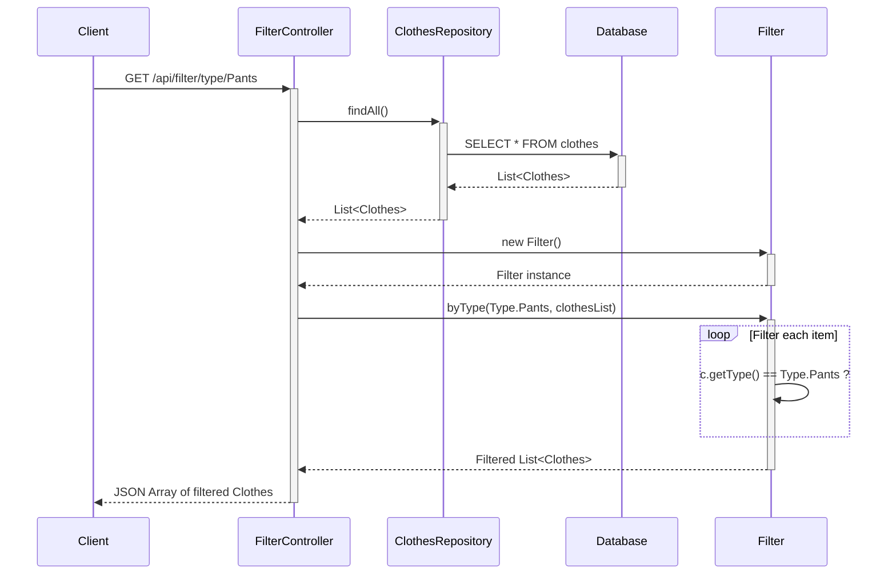

# Filter Clothes by Type Flow

This diagram shows how the system filters clothes by a specific type (e.g., Pants, Tops, etc.).

## API Endpoints:
- **Method**: GET
- **URLs**: 
  - `/api/filter/type/{type}` (Dress, Tops, Skirt, Pants, Jacket)
  - `/api/filter/season/{season}` (Winter, Summer, inBetween)
  - `/api/filter/size/{size}` (34, 36, 38, XS, S, M, L, XL)
  - `/api/filter/material/{material}` (Wool, Cotton, Polyester, etc.)
  - `/api/filter/clean/{clean}` (true, false)
  - `/api/filter/color/{color}` (Color object)

## Process:
1. Client requests clothes filtered by specific type
2. Controller fetches ALL clothes from database first
3. Creates new Filter instance (inefficient - should be injected)
4. Filter applies stream filtering logic to find matching items
5. Returns filtered list as JSON

## Potential Improvements:
1. **Inject Filter as dependency** instead of creating new instance each time
2. **Use database-level filtering** with custom repository methods instead of fetching all records
3. **Add pagination** for large datasets