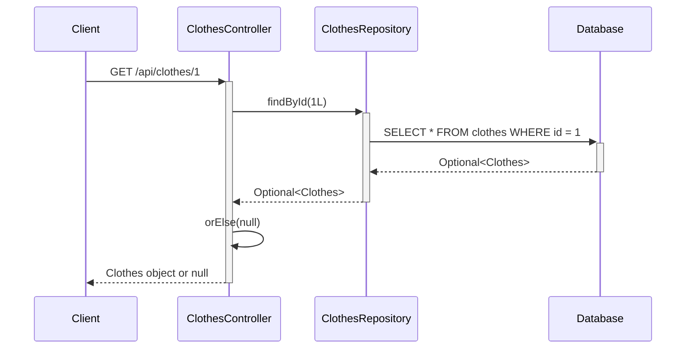

# Find Clothes by ID Flow

This diagram shows how the system retrieves a specific clothes item by its ID.



## API Endpoint:
- **Method**: GET
- **URL**: `/api/clothes/{id}`
- **Path Variable**: `id` (Long) - The ID of the clothes item
- **Response**: Clothes object if found, null if not found

## Process:
1. Client requests specific clothes item by ID
2. Controller calls repository with the ID
3. Repository queries database for clothes with matching ID
4. Database returns Optional<Clothes> (empty if not found)
5. Controller uses `orElse(null)` to handle empty Optional
6. Returns clothes object or null to client

## Potential Issues:
- **Returns null instead of proper HTTP status**: Should return 404 Not Found when clothes not found
- **No error handling**: Doesn't handle invalid ID formats

## Suggested Improvement:
```java
@GetMapping("/{id}")
public ResponseEntity<Clothes> findClothes(@PathVariable long id) {
    Optional<Clothes> clothes = repository.findById(id);
    if (clothes.isPresent()) {
        return ResponseEntity.ok(clothes.get());
    } else {
        return ResponseEntity.notFound().build();
    }
}
```