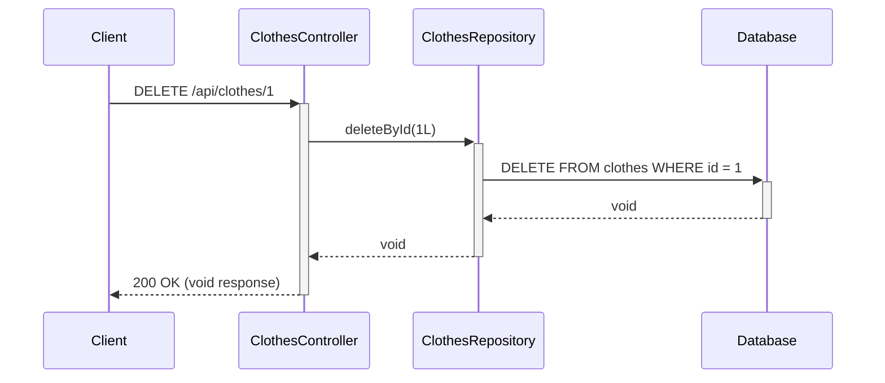

# Delete Clothes Flow

This diagram shows how the system deletes a clothes item by its ID.



## API Endpoint:
- **Method**: DELETE
- **URL**: `/api/clothes/{id}`
- **Path Variable**: `id` (Long) - The ID of the clothes item to delete
- **Response**: 200 OK with empty body

## Process:
1. Client sends DELETE request for specific clothes item
2. Controller calls repository to delete by ID
3. Repository executes DELETE SQL statement
4. Database removes the record (if it exists)
5. Controller returns 200 OK with void response

## Characteristics:
- **Silent deletion**: No confirmation if item actually existed
- **No error handling**: Doesn't check if item was found before deletion
- **Void return**: No feedback about operation success

## Potential Improvements:
```java
@DeleteMapping("/{id}")
public ResponseEntity<Void> deleteClothes(@PathVariable long id) {
    if (repository.existsById(id)) {
        repository.deleteById(id);
        return ResponseEntity.ok().build();
    } else {
        return ResponseEntity.notFound().build();
    }
}
```

This would provide proper HTTP status codes:
- **200 OK**: Successfully deleted
- **404 Not Found**: Item didn't exist