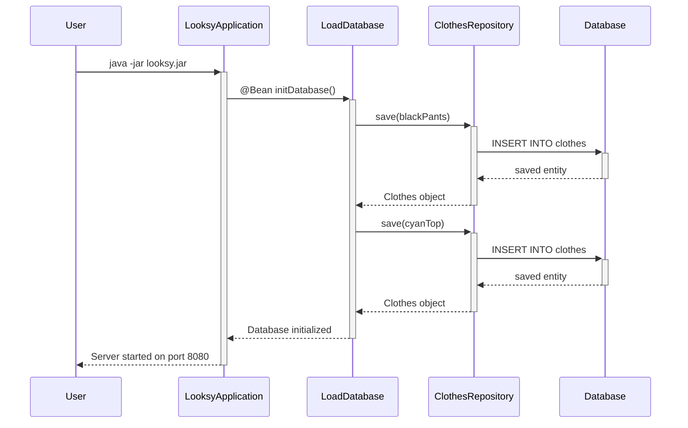
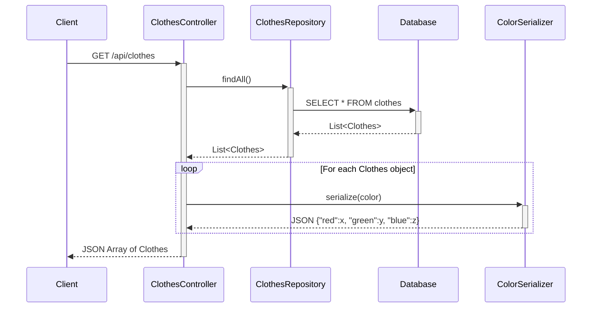
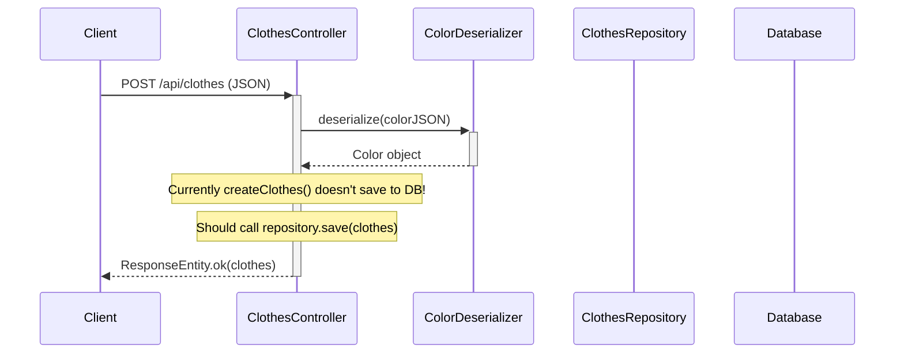
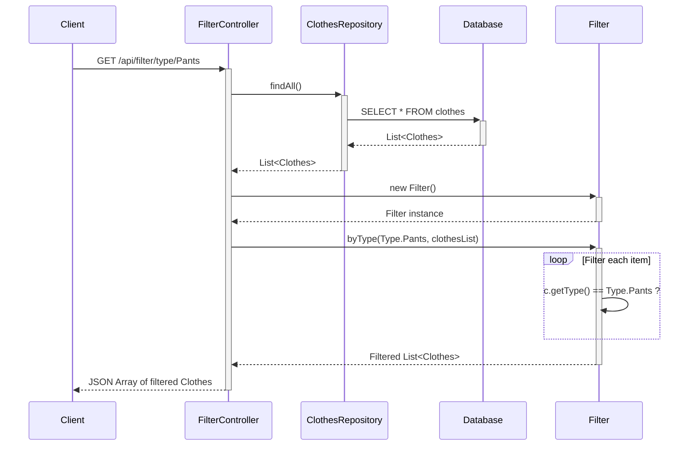
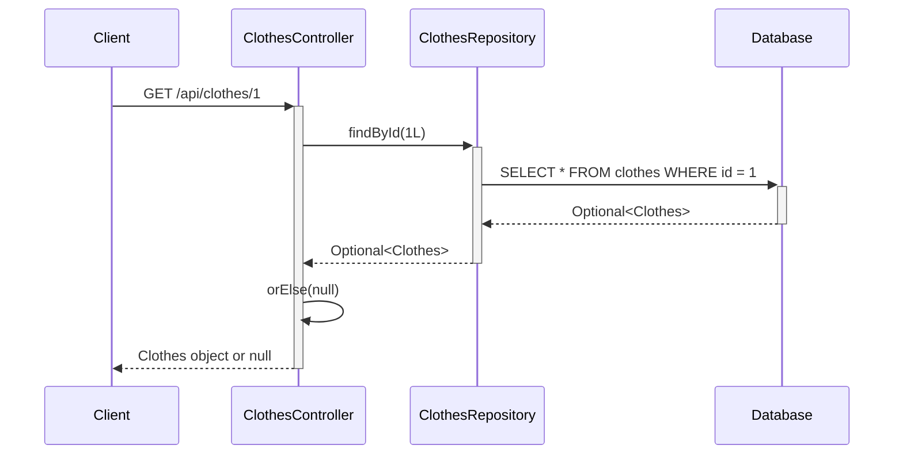
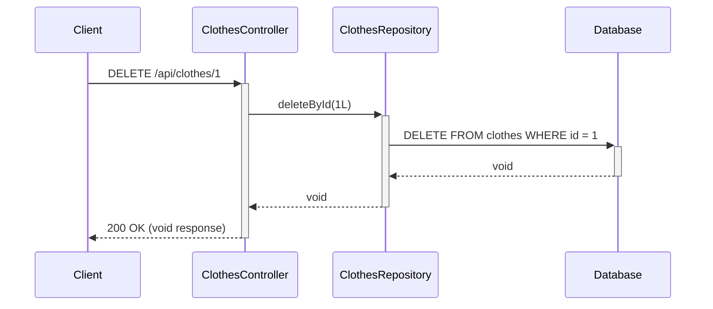

# Looksy Digital Wardrobe - Sequence Diagrams

## Main Application Flows

### 1. Application Startup Flow


### 2. Get All Clothes Flow


### 3. Create New Clothes Flow


### 4. Filter Clothes by Type Flow


### 5. Find Clothes by ID Flow


### 6. Delete Clothes Flow


### 7. Size Conversion with Exception Flow
```mermaid
sequenceDiagram
    participant Client
    participant SomeController
    participant Size
    participant NoKnownSize
    
    Client->>+SomeController: convertSize(Size._46)
    SomeController->>+Size: onlyLetters(Size._46)
    
    alt Size not in conversion range
        Size->>+NoKnownSize: throw new NoKnownSize()
        NoKnownSize-->>-Size: RuntimeException
        Size-->>-SomeController: Exception thrown
        SomeController-->>-Client: 500 Internal Server Error
    else Size in conversion range
        Size-->>-SomeController: Converted size (e.g., _XL)
        SomeController-->>-Client: Converted size response
    end
```

## Notes:
- **Issue in ClothesController.createClothes()**: Currently doesn't save to database, only returns the object
- **FilterController Pattern**: Each filter method creates a new Filter instance instead of injecting it
- **Error Handling**: Most endpoints lack proper error handling and validation
- **Service Layer**: ClothesService exists but isn't used by controllers